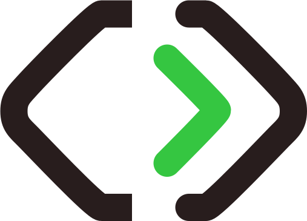

  

# IndicaCode

🎯 **Soluções full‑stack que transformam desafios reais em resultados.**

Somos uma empresa brasileira de software fundada por desenvolvedores full‑stack e empreendedores. Acreditamos que **resolver problemas com tecnologia é a base de qualquer negócio**.

---

## ⚙️ Nossa stack

- **Backend**: .NET Core (WebAPI, MVC, Razor)
- **Frontend web**: ReactJS, NextJS
- **Banco de dados**: RavenDB
- **Desktop / POS**: .NET Windows Forms, integrando com componentes profissionalizantes

---

## 🚀 Projetos em destaque

### App Turístico
Plataforma para moradores e turistas de Caldas Novas (GO) com vagas de emprego, serviços locais e, em breve, e‑commerce local com modelo de comissão.

### ERP  
(Em Desenvolvimento)

---

## 💡 Nossa visão

Transformar empresas por meio de software bem‑estruturado, com governança, escalabilidade e foco em produtividade real.  
Open‑source é parte da nossa cultura: apoiamos iniciativas colaborativas e mantemos princípios transparentes.

---

## 📬 Contato

- Email: **contato@indicacode.com.br**  
- LinkedIn / GitHub: [IndicaIn](https://linkedin.com/indicacode)  
- Site institucional: (em breve no ar)

---

## 🤝 Participe

Explore nossos repositórios públicos, abra issues, contributa com pull requests e acompanhe nossa evolução!

> _Registro no Simples Nacional e iniciativa admitida no programa Inova Simples._
